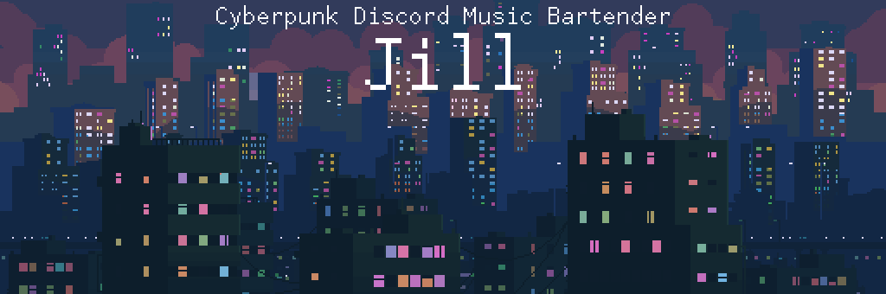
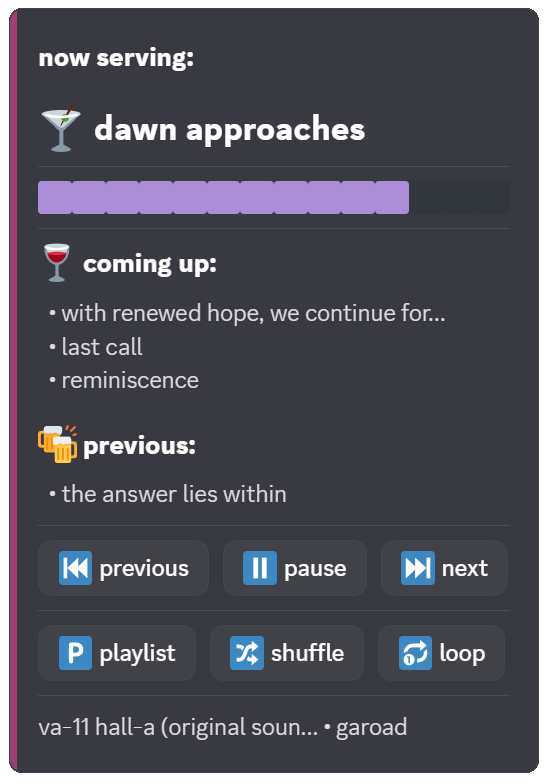
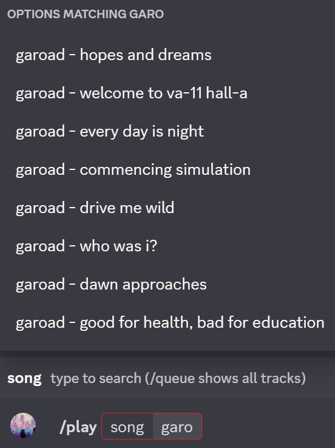
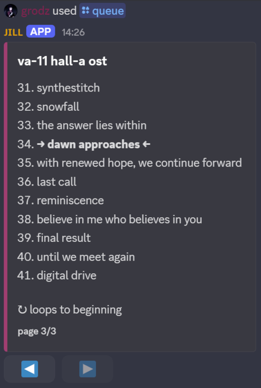

  

Your local music library, on tap in Discord.

---

### Features

- **Control panel** - like a real music player
- **Your music** - put songs in folders, get playlists
- **Clean bar** - messages auto-delete, keeps things tidy
- **Configurable** - permissions, colors, emojis, messages

---

### Screenshots

<table>
  <tr>
    <td></td>
    <td></td>
    <td></td>
  </tr>
</table>

---

### Quick start

**First:** [Create your Discord bot](docs/setup/discord-setup.md) and get your token.

**Then pick your platform:**
- [Linux](docs/setup/linux-setup.md) - for nerds
- [Docker](docs/setup/docker-setup.md) - for fancy nerds
- [Windows](docs/setup/windows-setup.md) - for weirdos

---

#### Docs

|  |  |  |
|-------|---------------|-------|
|  |  |  |
|  |  |  |
|  |  |  |
|  |  |  |

---

`Made with Claude. Mostly.`

