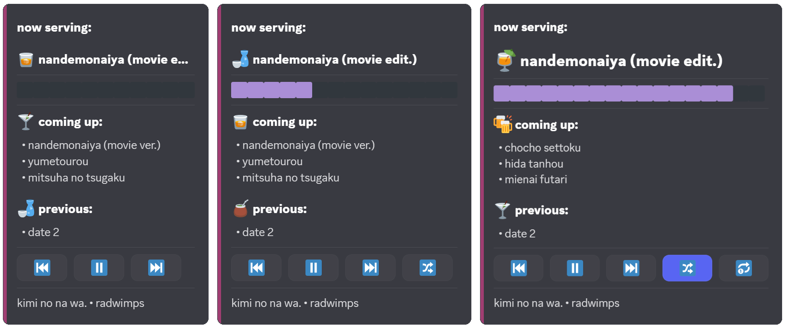

# Control Panel

An interactive Discord embed with buttons for playback control. Appears when you use `/play`.

---

### Buttons

| Button | What it Does |
|--------|--------------|
| ⏮ Previous | Go back to the previous track in the queue |
| ▶️ / ⏸ Play/Pause | Toggle playback. If Jill isn't in voice, joins your channel and starts playing |
| ⏭ Next | Skip to the next track in the queue |
| 🔀 Shuffle | Toggle shuffle mode (lights up when active) |
| 🔂 Loop | Toggle song repeat (lights up when active) |
| 🇵 Playlist | Open playlist picker - select from dropdown to switch |

> [!NOTE]
> You must be in the same voice channel as Jill to use buttons. When Jill isn't in a voice channel, `shuffle`, `loop`, and `playlist` still work.

> [!TIP]
> `shuffle`, `loop`, and `playlist` buttons can be hidden in [settings](../configuration/settings.md#panel-appearance) (or [here](../configuration/environment.md) for Docker). `playlist` auto-hides with only one playlist.

---

### Behavior

- **Adaptive layout** - Panel adjusts based on how many buttons are enabled
- **Auto-recreation** - Panel recreates every 30 minutes ([configurable](../configuration/settings.md#panel-appearance)) to stay responsive
- **Moving the panel** - `/pause` or `/stop`, delete the message, go to new text channel, `/play`

---

See [Settings](../configuration/settings.md#panel-appearance) to customize appearance. See [Troubleshooting](../troubleshooting.md#panel) if something's not working.
